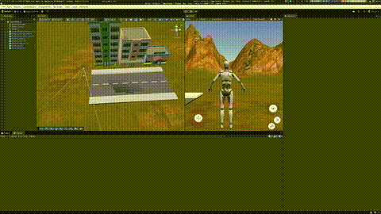

# Unity II (Inteligent Interface)

A Game that show all position of all objects. The high-building, small-building and show
Also the position of the Terrain, roads and player are show on the console.

# Example of Use 

